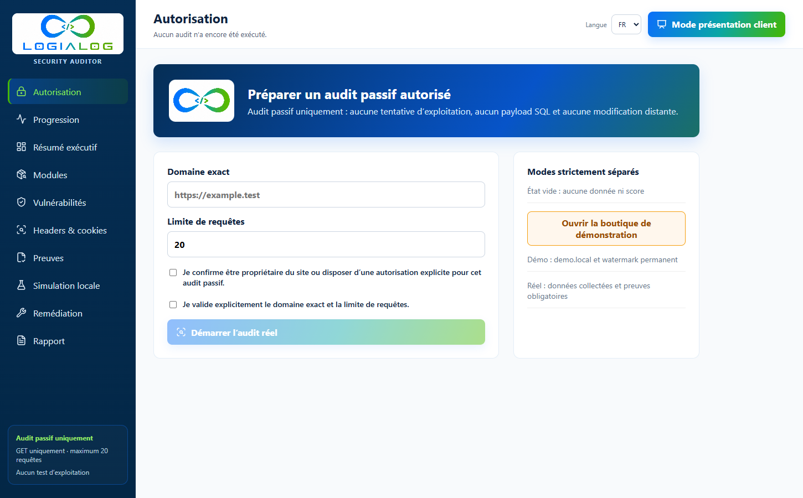
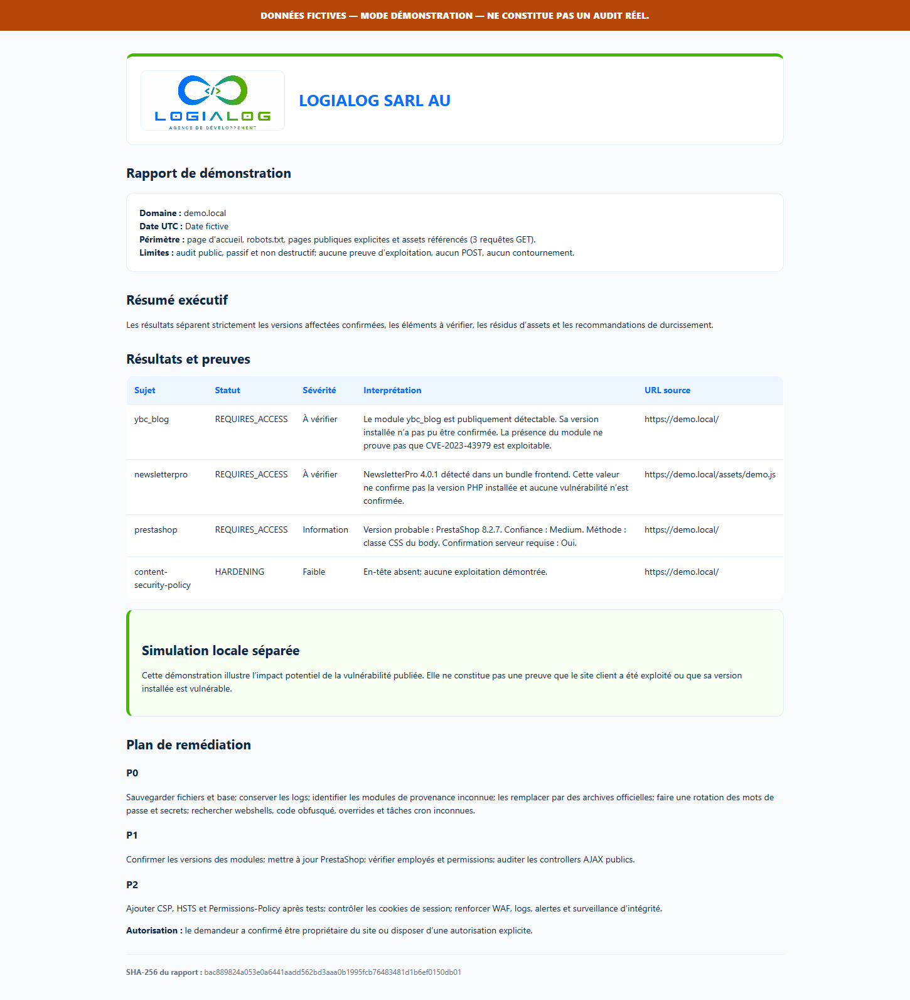

# LOGIALOG PrestaShop Security Auditor

<p align="center">
  
</p>

<p align="center">
  <strong>Audits PrestaShop passifs, preuves traçables et rapports client autonomes.</strong><br>
  Local-first · Safe-by-default · Evidence-first
</p>

<p align="center">
  <a href="https://github.com/logialog/prestashop-security-auditor/actions/workflows/ci.yml"></a>
  
  
  
  
  
  
</p>

Outil local d’audit passif et non destructif pour boutiques PrestaShop autorisées. Il n’effectue aucune exploitation, aucun POST, aucun brute force et aucun contournement de protection. L’interface et les services Docker sont publiés uniquement sur `127.0.0.1`.

> [!IMPORTANT]
> Utilisez cet outil uniquement sur une boutique dont vous êtes propriétaire ou pour laquelle vous disposez d’une autorisation explicite et documentée. Un module détecté ou une version inconnue ne constitue jamais, à lui seul, une vulnérabilité confirmée.

## Aperçu

| Dashboard d’autorisation | Rapport client autonome |
| --- | --- |
|  |  |

## Ce qui différencie l’outil

- **Preuve obligatoire** : chaque finding réel conserve l’URL, la date UTC, un extrait nettoyé, la méthode, la confiance et le SHA-256 de la réponse.
- **Incertitude explicite** : les statuts distinguent confirmation, version à vérifier, résidu d’asset, non-affecté et durcissement.
- **Sécurité opérationnelle** : même domaine, GET uniquement, délai minimal, budget maximal de 20 requêtes et double confirmation opérateur.
- **Workflow développeur** : exports JSON, SARIF 2.1.0, SBOM CycloneDX 1.6, CLI, policy packs et monitoring local.
- **Livraison agence** : rapports white-label validés, bundles Ed25519, multistore isolé et historique append-only.
- **Communauté encadrée** : SDK d’extracteurs borné, advisories révisés manuellement et fixtures sans boutique réelle.

## Démarrage rapide

```sh
git clone https://github.com/logialog/prestashop-security-auditor.git
cd prestashop-security-auditor
docker compose up --build
```

Ouvrir [http://127.0.0.1:5173](http://127.0.0.1:5173). L’API reste locale sur `http://127.0.0.1:8000`.

## Documentation

| Besoin | Guide |
| --- | --- |
| Comprendre les formats exportés | [Contrat JSON et SARIF](docs/EXPORT_CONTRACT.md) |
| Scanner un checkout local | [CLI et source scan](#cli-développeur) |
| Créer un rapport agence | [Profils white-label](docs/REPORT_PROFILES.md) |
| Signer une livraison | [Bundles de rapport](docs/REPORT_BUNDLES.md) |
| Auditer plusieurs boutiques | [Mode multistore](docs/MULTISTORE.md) |
| Ajouter un extracteur | [SDK d’extracteurs](docs/EXTRACTOR_SDK.md) |
| Contribuer sans données réelles | [Guide de contribution](CONTRIBUTING.md) |
| Signaler une vulnérabilité | [Politique de sécurité](SECURITY.md) |

## Modes de données

- **État vide** : aucun domaine, score, finding, module, version ou historique au premier lancement.
- **Mode démonstration** : données exclusivement fictives pour `demo.local`, avec watermark orange permanent dans l’interface et le rapport.
- **Audit réel** : données issues uniquement des réponses collectées. Chaque finding réel exige une URL source, une date UTC, un hash SHA-256, un extrait nettoyé, une méthode d’extraction et un niveau de confiance.

## Prérequis

- Docker Desktop avec Compose, ou Python 3.13 et Node.js 22.
- Une autorisation explicite du propriétaire de la boutique.

## Lancement avec Docker

Windows PowerShell et Linux :

```sh
docker compose up --build
```

Ouvrir `http://127.0.0.1:5173`. L’API est sur `http://127.0.0.1:8000`.

Arrêt :

```sh
docker compose down
```

## Lancement sans Docker

PowerShell :

```powershell
py -3.13 -m venv .venv
.\.venv\Scripts\Activate.ps1
pip install -r backend\requirements-dev.txt
uvicorn backend.app.main:app --host 127.0.0.1 --port 8000
```

Dans un second terminal :

```powershell
cd frontend
npm ci
npm run dev
```

Linux :

```sh
python3.13 -m venv .venv
. .venv/bin/activate
pip install -r backend/requirements-dev.txt
uvicorn backend.app.main:app --host 127.0.0.1 --port 8000
```

Puis `cd frontend && npm ci && npm run dev`.

## Créer un audit et exporter le rapport

Ouvrir l’interface, saisir le domaine autorisé, cocher la confirmation d’autorisation puis démarrer. Le scanner consulte seulement l’accueil, `robots.txt`, les pages publiques explicitement fournies à l’API et leurs assets CSS/JS du même domaine. Le rapport est disponible dans l’écran **Rapport**; utiliser la fonction d’impression du navigateur pour créer un PDF. Une copie HTML et l’historique SQLite restent dans `reports/`.

Aucun domaine réel n’est préconfiguré. Toute donnée réelle doit être collectée lors d’un audit autorisé, après les deux confirmations opérateur.

Les résultats sont aussi disponibles en JSON portable et en SARIF 2.1.0 :

- `/api/audits/{id}/export.json`
- `/api/audits/{id}/export.sarif`
- `/api/demo/export.json` et `/api/demo/export.sarif` pour les données fictives clairement marquées

L’export portable exclut le chemin local du rapport. Le SARIF conserve l’URL, la date, le hash de réponse, la confiance et la méthode de détection de chaque preuve. Les garanties de compatibilité sont décrites dans [docs/EXPORT_CONTRACT.md](docs/EXPORT_CONTRACT.md).

Après un deuxième audit réel du même domaine, `/api/audits/{id}/comparison` retourne les findings ajoutés, résolus, modifiés ou inchangés ainsi que l’évolution du score. Les données de démonstration et les domaines différents sont systématiquement exclus.

## CLI développeur

Valider les advisories embarqués :

```powershell
.\.venv\Scripts\python.exe -m backend.app.cli advisories validate
```

Après une modification revue des advisories, régénérer leur manifest SHA-256 avec `python -m backend.app.cli advisories manifest`. La validation CI vérifie ensuite les records et le manifest.

Les imports de sources externes passent obligatoirement par une proposition locale `pending`; ils ne modifient jamais automatiquement la base approuvée. Voir [docs/ADVISORY_REVIEW.md](docs/ADVISORY_REVIEW.md).

Exécuter un audit autorisé et produire un SARIF :

```powershell
.\.venv\Scripts\python.exe -m backend.app.cli scan https://boutique.example --authorized --format sarif --output reports\audit.sarif
```

Exporter un audit déjà enregistré :

```powershell
.\.venv\Scripts\python.exe -m backend.app.cli export AUDIT_ID --format json --output reports\audit.json
```

Générer une version white-label du rapport à partir d’un profil validé :

```powershell
.\.venv\Scripts\python.exe -m backend.app.cli report render AUDIT_ID --profile docs\report-profile.example.json --output reports\client-report.html
```

Le nom, le titre, les couleurs, le contact et un logo bitmap intégré peuvent être personnalisés. La provenance et la version du moteur LOGIALOG restent immuables dans les métadonnées HTML. Voir [docs/REPORT_PROFILES.md](docs/REPORT_PROFILES.md).

Valider puis lancer un périmètre multistore explicitement autorisé :

```powershell
.\.venv\Scripts\python.exe -m backend.app.cli multistore validate --manifest multistore.local.json
.\.venv\Scripts\python.exe -m backend.app.cli multistore scan --manifest multistore.local.json --output reports\multistore-audit.json
```

Chaque boutique produit son propre audit, ses propres preuves et son propre rapport. Les exécutions sont séquentielles, limitées à 20 requêtes par boutique et 100 au total. Voir [docs/MULTISTORE.md](docs/MULTISTORE.md).

Créer puis vérifier un bundle de livraison signé :

```powershell
.\.venv\Scripts\python.exe -m backend.app.cli bundle create AUDIT_ID --output reports\audit-bundle.zip --private-key C:\chemin\hors-projet\private.pem --profile docs\report-profile.example.json
.\.venv\Scripts\python.exe -m backend.app.cli bundle verify --bundle reports\audit-bundle.zip --public-key C:\chemin\public.pem
```

Le ZIP contient le rapport, le JSON, le SARIF et le snapshot advisory, accompagnés d’un manifest de hashes signé Ed25519. Voir [docs/REPORT_BUNDLES.md](docs/REPORT_BUNDLES.md).

Appliquer une policy sans modifier l’audit :

```powershell
.\.venv\Scripts\python.exe -m backend.app.cli policy validate --policy policies\agency-release.json
.\.venv\Scripts\python.exe -m backend.app.cli policy evaluate AUDIT_ID --policy policies\agency-release.json --output reports\policy-result.json
```

Une décision `FAIL` utilise l’exit code `10`. Les packs fournis couvrent une gate agence stricte et une gate de triage. Voir [docs/POLICY_PACKS.md](docs/POLICY_PACKS.md).

Exécuter un contrôle planifiable qui reste silencieux sans changement :

```powershell
.\.venv\Scripts\python.exe -m backend.app.cli monitor validate --config monitor.local.json
.\.venv\Scripts\python.exe -m backend.app.cli monitor run --config monitor.local.json --output reports\monitor-result.json
```

La première exécution établit une baseline sans notification. Un changement configuré retourne l’exit code `11`; un état inchangé retourne `0`. Voir [docs/MONITORING.md](docs/MONITORING.md).

Récupérer l’inventaire authentifié du companion optionnel :

```powershell
$env:LOGIALOG_COMPANION_SECRET = "<secret copié depuis le Back Office>"
.\.venv\Scripts\python.exe -m backend.app.cli companion fetch --endpoint https://shop.example/module/logialogsecuritybridge/inventory --secret-env LOGIALOG_COMPANION_SECRET --authorized --output reports\companion-inventory.json
```

Le module ne retourne que la version PrestaShop, les modules actifs et les boutiques configurées. Voir [docs/COMPANION_MODULE.md](docs/COMPANION_MODULE.md).

Tracer une revue dans le journal d’équipe local :

```powershell
.\.venv\Scripts\python.exe -m backend.app.cli history add AUDIT_ID --actor alice --event reviewed --note "Evidence reviewed"
.\.venv\Scripts\python.exe -m backend.app.cli history verify
.\.venv\Scripts\python.exe -m backend.app.cli history list --audit-id AUDIT_ID --output reports\audit-history.json
```

Le journal append-only est chaîné par SHA-256. L’acteur est une attribution explicite, pas une identité cryptographiquement authentifiée. Voir [docs/TEAM_HISTORY.md](docs/TEAM_HISTORY.md).

Exit codes stables : `0` succès sans alerte, `2` entrée ou autorisation invalide, `3` audit absent, `4` advisory invalide, `5` erreur d’exécution, `10` échec de policy/finding confirmé et `11` changement significatif détecté par le monitoring.

Inventorier un checkout PrestaShop local et produire un SBOM CycloneDX, sans réseau ni exécution du code analysé :

```powershell
.\.venv\Scripts\python.exe -m backend.app.cli source scan C:\chemin\vers\prestashop --format cyclonedx --output reports\sbom.json
```

L’inventaire n’exporte pas le contenu des fichiers et n’invente jamais une version absente. Il signale également les overrides PHP, le mode développeur et la présence locale du répertoire `install`, sans lire ni exporter les paramètres de base de données.

Repérer localement des patterns PHP nécessitant une revue manuelle :

```powershell
.\.venv\Scripts\python.exe -m backend.app.cli source review C:\chemin\vers\prestashop --output reports\code-review.json
```

La sortie contient uniquement la règle, le chemin, la ligne et la confiance. Elle n’exporte pas le code source et ne transforme jamais un signal en vulnérabilité confirmée.

La CI GitHub exécute uniquement la validation des advisories, les tests, le build et un smoke test Docker Compose lié à `127.0.0.1`. Elle ne lance aucun scan externe. L’intégration SARIF pour un environnement privé et explicitement autorisé est documentée dans [docs/GITHUB_ACTIONS.md](docs/GITHUB_ACTIONS.md). Le contrat et les règles de migration des données sont définis dans [docs/ADVISORY_SCHEMA.md](docs/ADVISORY_SCHEMA.md).

Voir [ROADMAP.md](ROADMAP.md) et [docs/COMPETITIVE_ANALYSIS.md](docs/COMPETITIVE_ANALYSIS.md) pour la stratégie produit et l’étude des outils existants.

## Calcul du score

Le score n’existe qu’après la fin d’un audit ou dans le mode démo explicitement marqué. Formule : départ à 100, puis `CONFIRMED` retire 25 points pour Critical, 15 pour High, 8 pour Medium et 3 pour Low; `LIKELY` retire 5 points; `REQUIRES_ACCESS` retire 2 points; `HARDENING` retire 1 point. `ASSET_RESIDUE` et `NOT_AFFECTED` ne retirent aucun point. Le minimum est 0. Chaque facteur est affiché par le bouton **Comprendre le calcul du score**. Aucune comparaison historique n’est présentée sans audit précédent réellement enregistré.

## Tests hors ligne

```powershell
pytest tests
cd frontend
npm test
npm run build
npx playwright install chromium
npm run test:e2e
```

La suite navigateur applique les règles WCAG 2 A/AA et WCAG 2.1 A/AA, vérifie le focus clavier, le RTL arabe, le layout mobile et l’absence de débordement horizontal. Sous Linux, les mêmes commandes s’appliquent ; la CI installe Chromium avec ses dépendances système.

## Laboratoire local (désactivé par défaut)

Le lab utilise uniquement des données fictives, n’accepte aucune cible et ne contient aucun payload réutilisable.

```sh
docker compose --profile lab up --build lab
```

Ouvrir `http://127.0.0.1:8010`. Arrêt complet :

```sh
docker compose --profile lab down
```

Sans Docker : `uvicorn lab.app:app --host 127.0.0.1 --port 8010`, puis arrêter avec `Ctrl+C`.

## Licence et marque

Le code et la documentation sont distribués sous [Apache License 2.0](LICENSE). Consultez également [NOTICE](NOTICE). Le nom et le logo LOGIALOG restent des marques de LOGIALOG SARL AU; la licence du code ne concède aucun droit de marque au-delà de l’attribution nécessaire.

## Statuts

`CONFIRMED` exige une version fiable située dans une plage affectée documentée. `LIKELY` exige plusieurs preuves concordantes. `REQUIRES_ACCESS` indique une version réelle inconnue. `ASSET_RESIDUE` est une trace limitée à un bundle. `NOT_AFFECTED` exige une version corrigée confirmée. `HARDENING` décrit une défense manquante sans exploitation démontrée.
