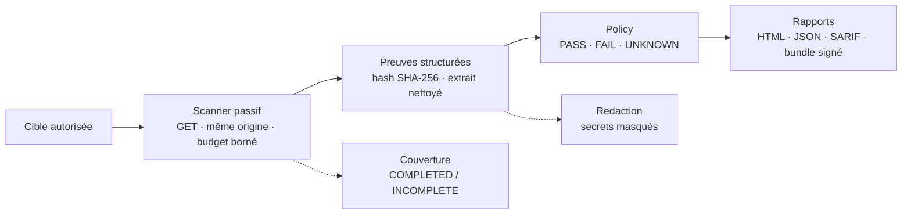

# LOGIALOG PrestaShop Security Auditor

<p align="center">
  
</p>

<p align="center">
  <strong>Audits PrestaShop passifs, preuves traçables et rapports client autonomes.</strong><br>
  Local-first · Safe-by-default · Evidence-first
</p>

<p align="center">
  <a href="https://github.com/logialog/prestashop-security-auditor/actions/workflows/ci.yml"></a>
  
  
  
  
  
  
</p>

Outils local d’audit PrestaShop **passif, non destructif et prouvable** : observations publiques autorisées, preuves hashées, décision de policy explicite et rapports livrables. Tout tourne sur `127.0.0.1` ; l’outil ne réalise aucune exploitation, aucun POST, aucun brute force et aucun contournement de protection.

> [!IMPORTANT]
> Utilisez cet outil uniquement sur une boutique dont vous êtes propriétaire ou pour laquelle vous disposez d’une autorisation explicite et documentée. Un module détecté ou une version inconnue ne constitue jamais, à lui seul, une vulnérabilité confirmée.

<p align="center">
  
  <br>
  <em>Capture de démonstration — données fictives (`demo.local`).</em>
</p>

## Sommaire

- [Valeur](#valeur)
- [Principes de sécurité](#principes-de-sécurité)
- [Architecture](#architecture)
- [Capacités](#capacités)
- [Démarrage rapide](#démarrage-rapide)
- [API locale](#api-locale)
- [CLI](#cli)
- [Documentation](#documentation)
- [Feuille de route](#feuille-de-route)
- [Licence et marque](#licence-et-marque)

## Valeur

- **Preuve obligatoire** : chaque finding réel conserve URL, date UTC, extrait nettoyé, méthode, confiance et SHA-256.
- **Incertitude explicite** : les statuts distinguent confirmation, version à vérifier, résidu d’asset, non-affecté et durcissement.
- **Sécurité opérationnelle** : même origine, `GET` uniquement, délai minimal, budget borné et autorisation explicite.
- **Livrable agence** : exports JSON/SARIF, rapports white-label, bundles signés Ed25519, monitoring et multistore isolé.

## Principes de sécurité

- **NO EVIDENCE != PASS** — l’absence de preuve n’établit pas un état sûr.
- **FAILED OBSERVATION != SAFE OBSERVATION** — un échec n’est pas un résultat négatif sûr.
- **PARTIAL COVERAGE != COMPLETED AUDIT** — une couverture partielle ne satisfait pas une gate incomplète.
- **UNKNOWN COVERAGE != PASS** — une couverture inconnue bloque `PASS`.
- **EXTERNAL SOURCE != TRUSTED FINDING** — une donnée externe reste non fiable jusqu’à revue et signature.

La couverture est `COMPLETED` ou `INCOMPLETE`, avec raisons structurées (`HTTP_STATUS`, `TRANSPORT_ERROR`, `EXTRACTOR_ERROR`, `CHECK_NOT_TESTED`, `BUDGET_EXHAUSTED`, `REDIRECT_LOOP`). Une couverture incomplète ne produit jamais `PASS` : la décision devient `UNKNOWN`.

## Architecture



Scanner local borné, preuves nettoyées avant export, décision de policy séparée de la complétude, codes de sortie CLI stables pour l’automatisation.

## Capacités

| Domaine | Vérifie | Preuve | Limite |
| --- | --- | --- | --- |
| Couverture | observations obligatoires terminées | `COMPLETED`/`INCOMPLETE` + incidents | `PASS` exige une couverture complète |
| Transport / redirections | statut, erreurs, chaînes et boucles | incidents structurés | aucune exploitation |
| En-têtes de sécurité | CSP, HSTS, Permissions-Policy, X-Frame-Options, X-Content-Type-Options, Referrer-Policy | finding `HARDENING` + preuve d’absence | défense en profondeur |
| Cookies | `Secure`, `HttpOnly`, `SameSite` | métadonnées | pas d’exploitabilité |
| Fingerprint modules/versions | modules, thèmes, version cœur | preuves d’extraction | version serveur parfois inconnue |
| Corrélation advisories | version vs plage affectée, snapshot signé | `CONFIRMED`/`NOT_AFFECTED`/`REQUIRES_ACCESS`/`ASSET_RESIDUE` | pas de revendication d’exploitation |
| Inventaire source local | cœur, modules, Composer, overrides, mode dev, `install/` | composants + hash de preuve | lecture seule |
| Évaluation advisory locale | version locale vs snapshot vérifié | `AFFECTED`/`NOT_AFFECTED`/`INDETERMINATE` | `AFFECTED` != exploitation |
| Revue de patterns PHP | `eval`, process, `unserialize`, `base64_decode` | signal (règle, chemin, ligne, confiance) | signal de revue |
| Monitoring | changements vs baseline réelle | résultat de monitoring | baseline incomplète ignorée |
| Multistore | périmètres isolés séquentiels | audit portable par boutique | pas de fusion de preuves |
| Exports & bundles | JSON/SARIF, bundle ZIP signé | artefacts vérifiables | clé privée hors dépôt |
| Policy | seuils, statuts, confiance | `PASS`/`FAIL`/`UNKNOWN` | jamais `PASS` si incomplet |

## Démarrage rapide

```sh
git clone https://github.com/logialog/prestashop-security-auditor.git
cd prestashop-security-auditor
docker compose up --build
```

Ouvrir [http://127.0.0.1:5173](http://127.0.0.1:5173) ; l’API reste locale sur `http://127.0.0.1:8000`. Prérequis : Docker Desktop/Compose, ou Python 3.13 et Node.js 22.

<details>
<summary>Installation sans Docker, tests et laboratoire local</summary>

PowerShell :

```powershell
py -3.13 -m venv .venv
.\.venv\Scripts\Activate.ps1
pip install -r backend\requirements-dev.txt
uvicorn backend.app.main:app --host 127.0.0.1 --port 8000
```

Linux :

```sh
python3.13 -m venv .venv
. .venv/bin/activate
pip install -r backend/requirements-dev.txt
uvicorn backend.app.main:app --host 127.0.0.1 --port 8000
```

Puis, dans un second terminal : `cd frontend && npm ci && npm run dev`.

Tests hors ligne :

```powershell
pytest tests
cd frontend
npm test
npm run build
npx playwright install chromium
npm run test:e2e
```

La suite navigateur applique WCAG 2 A/AA et WCAG 2.1 A/AA (focus clavier, RTL arabe, mobile). Les tests scanner utilisent des transports simulés : aucun scan externe.

Laboratoire local (désactivé par défaut, données fictives uniquement) :

```sh
docker compose --profile lab up --build lab
```

Ouvrir `http://127.0.0.1:8010`, arrêt avec `docker compose --profile lab down`.

</details>

## API locale

- `GET /api/health` — état du service.
- `GET /api/demo`, `GET /api/demo/export.json`, `GET /api/demo/export.sarif` — données **fictives** clairement marquées.
- `GET /api/audits/{id}`, `GET /api/audits/{id}/report` — audit enregistré et rapport HTML.
- `GET /api/audits/{id}/export.json`, `GET /api/audits/{id}/export.sarif` — exports portables (chemin local du rapport exclu).
- `GET /api/audits/{id}/comparison` — comparaison avec l’audit réel précédent du même domaine (démo et domaines différents exclus).

## CLI

```powershell
# Audit autorisé vers SARIF
python -m backend.app.cli scan https://boutique.example --authorized --format sarif --output reports\audit.sarif

# Préflight sans réseau
python -m backend.app.cli doctor
python -m backend.app.cli plan https://boutique.example --authorized --max-requests 10 --delay 2 --public-page https://boutique.example/contact
```

Codes de sortie : `0` succès, `2` entrée/autorisation invalide, `3` audit absent, `4` advisory invalide, `5` erreur d’exécution / couverture incomplète, `10` échec policy ou finding confirmé, `11` changement significatif (monitoring), `12` préflight non prêt.

Commandes avancées (rapports white-label, bundles signés, multistore, companion, historique, inventory source, évaluation advisory locale, revue PHP, policy, monitoring) : voir la [documentation](#documentation).

## Documentation

| Besoin | Guide |
| --- | --- |
| Formats exportés | [Contrat JSON et SARIF](docs/EXPORT_CONTRACT.md) |
| Décisions d’architecture | [Registre des décisions de sécurité](docs/SECURITY_ARCHITECTURE_DECISIONS.md) |
| Préflight opérationnel | [Préflight](docs/OPERATIONAL_PREFLIGHT.md) |
| Policy packs | [Policy packs](docs/POLICY_PACKS.md) |
| Monitoring | [Monitoring](docs/MONITORING.md) |
| Multistore | [Mode multistore](docs/MULTISTORE.md) |
| Rapports white-label | [Profils de rapport](docs/REPORT_PROFILES.md) |
| Bundles signés | [Bundles de rapport](docs/REPORT_BUNDLES.md) |
| Évaluation advisory locale | [Assessments locaux](docs/LOCAL_ASSESSMENT.md) |
| SDK d’extracteurs | [SDK d’extracteurs](docs/EXTRACTOR_SDK.md) |
| Advisories | [Revue](docs/ADVISORY_REVIEW.md) · [Schéma](docs/ADVISORY_SCHEMA.md) |
| CI et SARIF | [GitHub Actions](docs/GITHUB_ACTIONS.md) |
| Companion optionnel | [Module companion](docs/COMPANION_MODULE.md) |
| Historique d’équipe | [Historique](docs/TEAM_HISTORY.md) |
| Validation scientifique | [Protocole du corpus](docs/VALIDATION_PROTOCOL.md) |
| Contribuer sans données réelles | [Contribution](CONTRIBUTING.md) |
| Signaler une vulnérabilité | [Politique de sécurité](SECURITY.md) |

## Feuille de route

- **Disponible** : scan passif, preuves hashées, policy `PASS`/`FAIL`/`UNKNOWN`, exports JSON/SARIF, rapports white-label, bundles signés, monitoring, multistore, inventaire source local, évaluation advisory locale, SDK d’extracteurs borné.
- **En cours / à venir** : durcissement continu des preuves, clarté des contrats publics, gouvernance de validation.
- **Direction** : enrichissement du post-scan local et des contrôles d’environnement, sans action intrusive.

Voir [ROADMAP.md](ROADMAP.md). Un `CHANGELOG.md` public est en préparation ; en attendant, voir [notes de version v1.0.0](docs/RELEASE_NOTES_v1.0.0.md).

<details>
<summary>Formule du score et statuts</summary>

Score : départ à 100 ; `CONFIRMED` retire 25 (Critical), 15 (High), 8 (Medium), 3 (Low) ; `LIKELY` 5 ; `REQUIRES_ACCESS` 2 ; `HARDENING` 1 ; `ASSET_RESIDUE` et `NOT_AFFECTED` 0 ; minimum 0.

Statuts : `CONFIRMED` exige une version fiable dans une plage affectée documentée. `LIKELY` exige plusieurs preuves concordantes. `REQUIRES_ACCESS` indique une version réelle inconnue. `ASSET_RESIDUE` est une trace limitée à un bundle. `NOT_AFFECTED` exige une version corrigée confirmée. `HARDENING` décrit une défense manquante sans exploitation démontrée.

</details>

## Licence et marque

Code et documentation sous [Apache License 2.0](LICENSE) ; voir aussi [NOTICE](NOTICE). Le nom et le logo LOGIALOG restent des marques de LOGIALOG SARL AU ; la licence du code ne concède aucun droit de marque au-delà de l’attribution nécessaire.
